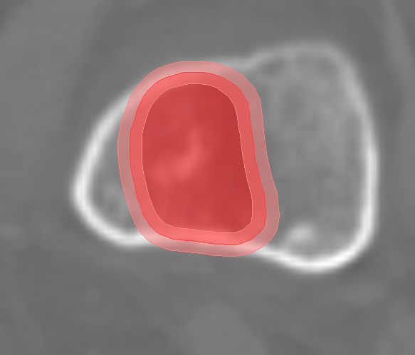

# Radiomic Data Pre-Processing Pipeline

<p> First step :

Add the pipeline path to sys.path so that your python compilator find all the modules of the pipeline : go to module handle_paths execute comand in terminal 

```
python add_pipeline_path.py /home/user/my_project/pipeline
```

[View PDF](./images/initial data.pdf)


### handle folder architecture : 

#### define_architecture_patients.py

It is good to start by organizing your files and standardize the architecture across patients

Patient_ID --> 
              Time --> 
                      Serie ID  

NOTE : assumes data is arranged in folder by patient

```
process_all_patients(root_path,depth)
```

```
process_patient(path)
```

inputs :

path : path to folder containing your patient data 
depth : depth at which you find patient folder
if your folder directly leads to patient folders then the depth is 1 if your folder contain fodlers per center for example, and then your patient folders, your depth is 2


#### handle_folder_and_files.py

delete,move,copy a file or a folder

#### tidy_series_folders_by_type_of_file.py

if you have nifti, dicom : ct and rtstruct in serie folder, organize them further into three separate folder

```
process_all_patients(root_path,depth)
```

```
process_patient(path)
```

inputs :

path : path to folder containing your patient data 
depth : depth at which you find patient folder

### conversion

#### convert_dicom_nifti.py

For the convertion of DICOM files into nifti format I use a pipeline developed by Alexandre Carre<sup>123</sup> 

https://github.com/U1030/DS2nii.git 

Please follow the installation steps described on the deposit and activate the environment before using the Step_3.py
```
1. U1030 Radiothérapie Moléculaire, Université Paris-Sud, Gustave Roussy, Inserm, Université Paris-Saclay, 94800, Villejuif, France
2. Université Paris Sud, Université Paris-Saclay, F-94270 Le Kremlin-Bicêtre, France
3. Gustave Roussy, Université Paris-Saclay, Department of Medical Physics, F-94805, Villejuif, France
```
run the following comand (before executing this step) 

```
conda activate DS2nii 
```

NOTE :  possible to use for one folder or several processed in parralel

```
convert_one_patient(patient_path)
```
```
process_all_patients(path, depth,direct)
```


path : path to folder containing your patient data 
depth : depth at which you find patient folder
direct : bool, if your patient folders can be found direclty is path then True else False

output : the nifti files 

once you are done with the conversion don't forget to deactivate the environment

```
conda deactivate DS2nii 
```

#### convert_dicom_nrrd.py


#### export_to_nifti_solution_artefact

The previously introduced pipeline DS2nii seems to be defective on CT that contain artefacts (when the patient has a piece of metal), it changes the intensity values of the voxels, this code aims to convert the CT serie that wasn't correclty converted by DS2nii

```
GetImage(dicom_path,output_path,save=True)
```

### missing data

#### find_CT_series_with_missing_RTSTRUCT_file.py

```
main(path)
```
path : path to folder containing your patient data 

output :  print path to CT series with missing RTSTRUCT file

#### problems_with_data.py 

```
main(dicom_path, nifti_path, output_path)
```

output : 

- missing_dates.txt
- missing_roi.txt
- duplicates.txt
- missing_nifti_present_in_dicom.txt


### preprocess ROI

#### resample_nifti.py

```
resample_patient(patient_path)
```

```
resample_all_patients(path, depth = 2, direct =True)
```

output : resampled file 

new_filename = file + "_RESAMPLED" 

#### rescaling.py

rescaling of voxel intensity (HU)

```
rescaling_mask(image, mask, lower_bound=-1000, upper_bound=3000)
```

```
rescaling_image(image, mask, lower_bound=-1000, upper_bound=3000)
```

outputs : sitk image

#### spatial_filter.py


```
apply_gaussian_filter(image,sigma)

```


```
apply_wavelet_filter(image,wavelet_type)

```

outputs : sitk image

#### preprocessing.py

complete preprocessing for feature extraction, follows similar steps to LifeX

- resampling to 1*1*1 voxel size 
- rounding intensity values
- rescaling intensity values to desired interval default -1000,3000
- spatial filters optional
- discretization of intensity values

```
preprocess_image(image_path,mask_path, filter_type=None, filter_param=None, rescale_range=(-1000, 3000), desired_bin_width = 10 )
```

outputs : image, mask as sitk images

#### delete_non_resampled.py

Delete nifti files that don't contain 'RESAMPLED'  in their filenames, allows to conserve only resampled files


```
main(path)
```

### handle roi


#### check_rings.py


The aim of this script is to assess if RTSTRUCT contours are correct in a scenario where you have a tumor and a ring around the tumor. We define correct by the following standards :

- the ring englobes the tumor
- the ring overlaps with tumor :
  
--> 2mm inside the tumor's border

--> 2mm outside the tumor's border

if the tumor is too small ( diameter <= 2mm ) the ring mask completelly overlaps with the tumor : contains no hole. 

<p align="center"></p>


The code detect the 3 scenarios outside of correct overlap as previously defined :
- complete overlap : the tumor is large enough (diameter>2mm) but has no hole
- no overlap : the ring doesn't overlap with the tumor 
- ring same size as tumor 


```
comand = ''
path = ''
depth = ''
direct = True

if comand == 'multiple_folders':
  process_all_patients(path,depth=depth,direct=direct)
elif comand  == "folder":
  process_folder(path)


```

outputs :

- no overlap lesions recap.txt
- complete overlap lesions recap.txt
- same size tumor and ring masks recap.txt


#### create_rings.py

Creates a nifti ring mask for every  nifti tumor mask that is missing a ring

```
comand = 'multiple_folders'
path = '' 

depth = ""
direct = True
tumor_accronym = 'gtv' or 'tum'

if comand == 'multiple_folders':
  process_all_patients(path,tumor_accronym = 'gtv',depth=depth,direct=direct)
elif comand  == "folder":
  process_patient(path, tumor_accronym='gtv')

```

output : a nifti file with name similar to the tumor mask file but replacing tumor accronym by ring

#### check_and_correct.py

Check if the rings are correct if not create new ring mask

```
comand = ''
path = ''
depth = ""
direct = True


if comand == 'multiple_folders':
  process_all_patients(path,depth=depth,direct=direct)
elif comand  == "folder":
  process_patient(path)

```

#### delete_external_contours.py

Some patients have a nifti mask that contours the hole body, if you wish to delete them execute this script

```
main(path)
```

input : path to the folder containing your patient folders

#### delete_lesions_too_small_diameter.py

delete lesions with diameter smaller than 5.5 mm
diameter is the smallest distance from the center of mass to the borders *2 

```
data_path = '' 

nifti_folders = extract.extract_folders_path(data_path, type='nifti')

clean_up_small_lesions(nifti_folders)
```

#### delete_lesions_too_small_voxel.py

delete lesions that occupy less than 64 voxels (lifeX can't extract features for volumes smaller than 64 voxels)

```
data_path = '' 

nifti_folders = extract.extract_folders_path(data_path, type='nifti')

clean_up_small_lesions(nifti_folders)
```

#### check_voxel_intensities

Check if intensity range of nifti corresponds to the original intensity range in the corresponding dicom , if not file is deleted and dicom is translated into nifti again with correct intensity

this script assumes you have tidied your series folders into dicoms, nifti folders

```
main(path)
```

#### rename_tx

If your nifti masks contain TX instead of T0/E0 or T1/E1  this allows to automatically rename them 

```
process_all_patients(path,depth = 2, direct =True)
```

input : path to your data

depth : if the data path doesn't imediatly lead to patient folder provide the depth to reach patient folders for example if your data is organized in the following way :
Data folder/ center/ patient folders the depth would be 2

direct : bool  if True it means the data folder immediatly lead to patient folders

#### ROI_properties

```
print_roi_properties(nifti_filepath)
```

outputs :

print("ROI bounds (x, y, z image coordinate space):")
print(f"Lower bound: {lower_bound}")
print(f"Upper bound: {upper_bound}")
print("size :", size)
print('origin :', origin)
print('spacing :', spacing)
print('direction :', direction)

#### bounding_box.py

Compute a bounding box around your tumor mask (nifti) two options : fixed size, around the tumor.

```
mask_path = ''
image_path = ''

box_size_mm = [40, 40, 20]

bb_fixed = compute_bb_fixed_size(image_path, mask_path, box_size_mm)
bb = compute_bb(mask_path)

```

output : tuple(slice(start, end) for start, end in zip(start_index, end_index))


#### detect_nifti_mask_with_several_components.py

This script allow to check the number of components of each mask in nifti format and decompose the mask in several masks if it contains several components


```
path = '' 
output_path = '' 

process_all_patients(path, output_path)


nifti_folders = find.extract_folders_path(path, type='nifti')
clean_up_nifti_folders(nifti_folders)
```

outputs :  new_file_name = f"{base_name}_component_{component_num}.nii.gz" 


#### delete_ring_with_no_corresponding_tum.py

delete nifti files of ring mask with no corresponding tumor mask

```
path = '' 
tumor_accronym = 'gtv'
main(path,tumor_accronym=tumor_accronym)

```

#### determine_nifti_mask_boundary_points.py


```
calculate_boundary_points(mask_path)
plot_mask_and_boundary(mask_path, zoom_factor=1.2)

```

output : list of coordinates in 3d array 

#### determine_nifti_mask_center_of_mass.py

```
get_center_of_mask_spicy(input_image)

plot_mask_and_center(mask_path)

```

input : mask path or sitk image

output : [coord_x,coord_y,coord_z] floats 


#### determine_nifti_mask_smallest_diameter.py

```
calculate_smallest_diameter_and_points(mask_path)

```

outputs : center_of_mass, boundary_points, closest_boundary_point, smallest_radius, smallest_diameter

#### determine_voi_size_in_number_of_pixels.py


```
get_size_of_roi(nifti_path)


```
output : float

```
extract_nifti_data(cohort_path)


```

output : lesions_volume_in_voxels.csv


#### extract_mask_voxels_from_image.py

retrives voxel of image in the mask

extract_masked_voxels(image, mask)

output : sitk image


### radiomic features extraction

extract radiomic features with pyradiomics

```
python3 feature_extraction_pyradiomics.py --path --index --output_path

```

index : index of patient id in input path

output : feature_extraction_results.csv

### utils

#### handle_lists.py


```
flatten_list(list_of_lists)

```


```
write_list_to_file(data_list, filename)

```

### data distribution

#### compute_voxel_intensities_distribution

input : path to folder containing your patient folders

output : a plot

```
main(path)

```

### vizualization

#### find_slices_where_nifti_mask_is.py

```
find_mask_slice(mask_path)

```

output : center_slice_axial, center_slice_coronal, center_slice_sagittal

#### visualize.py


```
read_and_visualize_single_mask(path)

```


```
plot_with_overlay(image_arr, mask_arr, slice_index, title='Overlay')

```


```
visualize_masks(mask_tumor, mask_ring, title="Masks Visualization")

```


```
visualize_single_mask(mask, title="Mask Visualization")

```
